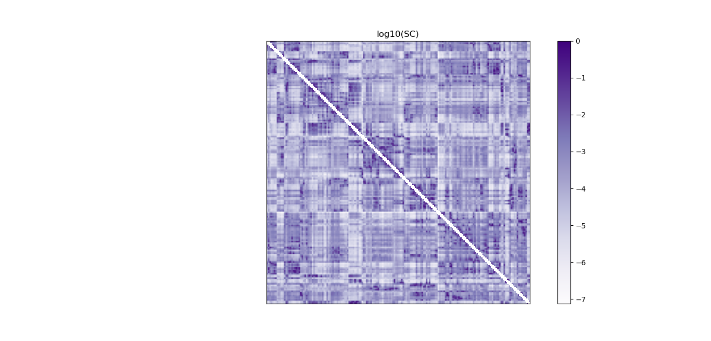
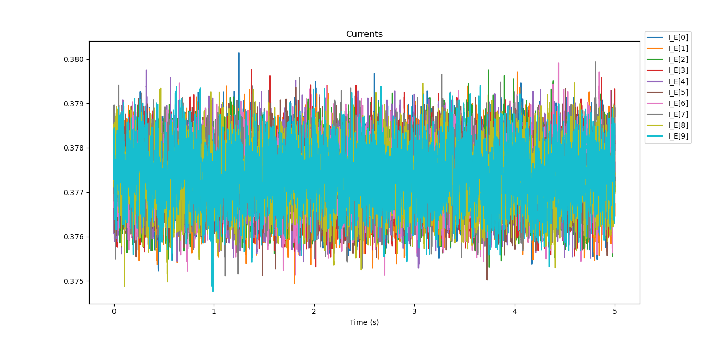
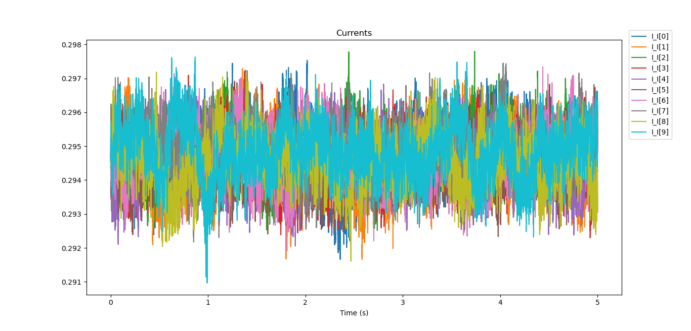
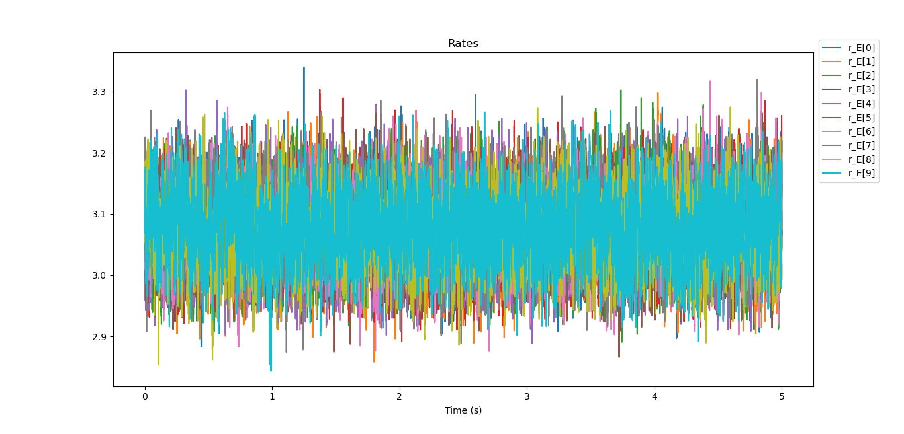
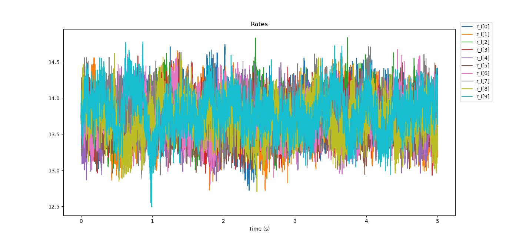
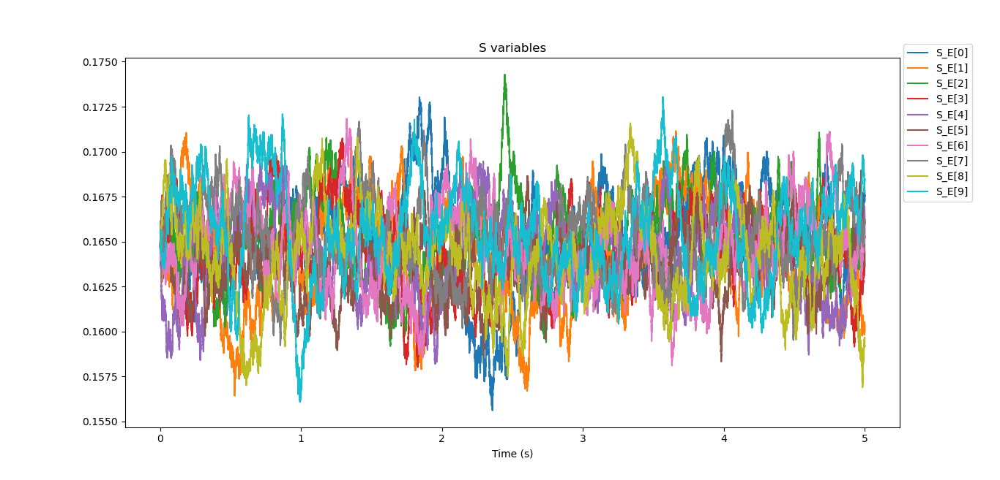
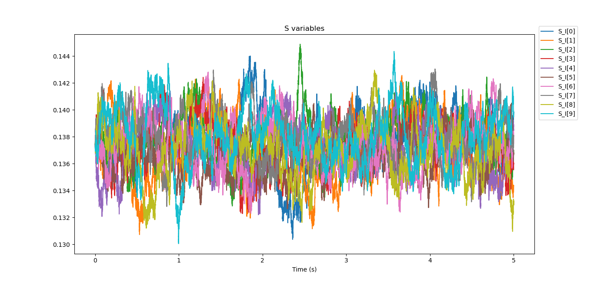
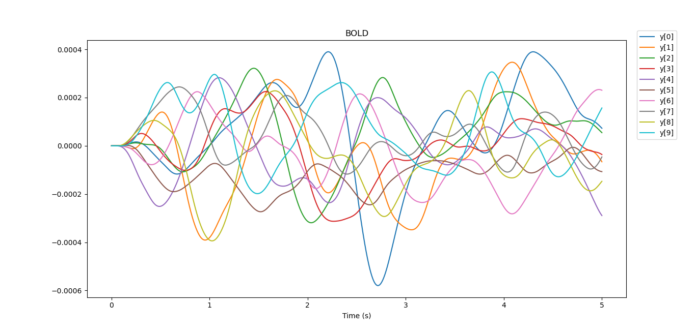

#### Simple example of Large Scale Model

python LargeScaleModel.py arg1 arg2 

    arg1: duration in seconds

    arg2: number of areas in figures
	
Example:

python LargeScaleModel.py 5 10

